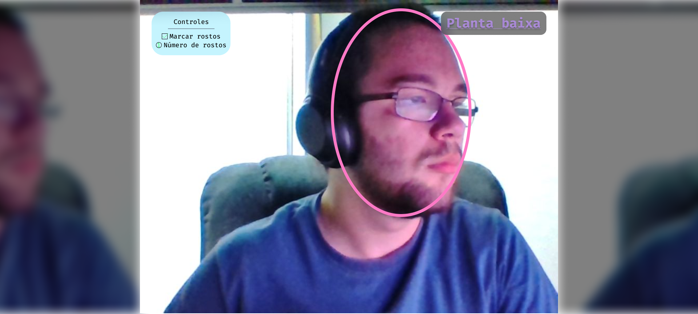

# domestic-supervisor

[][2] [][1]

A toy smart home simulator project.

<!-- markdown-toc start - Don't edit this section. Run M-x markdown-toc-refresh-toc -->

**Table of Contents**

- [domestic-supervisor](#domestic-supervisor)
  - [Project](#project)
  - [Interface design](#interface-design)
  - [Implementation](#implementation)
    - [Common entities](#common-entities)
    - [Supervisor entities](#supervisor-entities)
    - [Simulator entities](#simulator-entities)
  - [Acknowledgements](#acknowledgements)

<!-- markdown-toc end -->

## Project

Entails creating two programs, one to serve as a supervisor to a smart home's
systems and another to simulate said systems of this house, as no test bench is
available.

The programs should communicate through MQTT, a protocol used largely in
domestic automation.

The controlled/simulated systems are:

- Face detecting camera;
- Remote locks;
- Remote light bulbs;

Supervisor features:

- Show the camera's image with a marking of where (if present) a face was detected;
- Show the house's blue print with the indication of the lights and locks, which
  can be clicked to toggle state;
- React to events sent by the simulator, such as state changes to lights or
  locks;

Simulator features:

- Capture and image from the computer's webcam, sending it properly through
  MQTT;
- React to events sent by the supervisor, such as state changes to lights or
  locks, printing it in its view and returning a success signal to the
  supervisor;
- Simulate toggling lights or locks, at the physical location, external to the
  system, by showing a blueprint of the house and allowing clicks to toggle
  state;

## Interface design

Camera view:

Blue print view:

## Implementation

The project's implementation will be done in C++, in accordance to modern C++
good code practices.

### Common entities

- `utils` namespace:
  - Multiple `event`:
    - Keeps track of functions to be called upon being triggered;
    - May be called as a function to trigger;
    - Intended to be owned by some other object that has events as a concept
      and exposed by reference so callbacks may be registered;
- `controllers` namespace:
  - 2 `state`:
    - Manages the residence's state, keeping tabs of which lights and locks are
      on;
    - Registers callbacks to do things when the lights and/or locks change;
- Multiple `device`:
  - Represents a single device, capable of being toggle on or off;
  - Pairs this state information with constant location, type (light or lock),
    description and name information;
- `view` interface that inherits from `Wt::WWidget`:
  - Represents a view of the application;
  - Has a name and a path plus the elements of `Wt::WWidget`;
- Entities that inherit from `view` in the `views` namespace:
  - 2 `blueprint`:
    - The blueprint views's root widget;
    - Shown when the user navigates to "/blueprint";
- Entities that inherit from `Wt::WWidget` in the `widgets` namespace:
  - 2 `camera_panel`:
    - Draws the camera control panel according to the detection state and
      updates the count when it changes;
  - 2 `labeled_number`:
    - Draws a circumference with a number overlaid and a right-side label by
      receiving the arguments
      - Initial number;
      - Label to be written;

### Supervisor entities

- `controllers` namespace:
  - 1 `mqtt` that inherits from `mqtt::callback` and `mqtt::iaction_listener`:
    - Responsible for processing incoming messages and providing an API to send
      messages to the simulator's devices;
    - Provides methods to send light and/or lock state change request messages;
    - Registers callbacks to do things when light and/or lock state change
      notifications arrive;
  - 1 `deepnet`:
    - Responsible for applying the face detection algorithm on received images
      and marking the detections;
    - Processes in a separate thread, as to not block the GUI with a heavy image
      processing workload;
    - Allows to push images to a queue, which will be processed in FIFO order;
    - Does its processing through a deep neural network built with the dlib
      library;
    - May be disabled/enabled, to mitigate resource usage when the camera view
      is not shown or the user does not want facial detection;
    - Registers callbacks to do things when the number of detections changes;
- Entities that inherit from `view` in the `views` namespace:
  - 1 `camera`:
    - The camera view's root widget;
    - Shown when the user navigates to the path "/camera" or "/";
  - 1 `not_connected`:
  - Prints an error message to the screen when the simulation system is not
    connected;
- Entities that inherit from `Wt::WWidget` in the `widgets` namespace:
  - 2 `page_anchor`:
    - Draws the page switch button by receiving the arguments
      - Top left corner position;
      - Entity that implements `view` to be shown when clicked;
- 1 `domestic_supervisor` that inherits from `Wt::WApplication`:
  - Represents the application as a whole;
  - Defines the server's life-cycle methods (startup, connect, run,
    shutdown...);

### Simulator entities

- `controllers` namespace:
  - 1 `mqtt` that inherits from `mqtt::callback` and `mqtt::iaction_listener`:
    - Responsible for processing incoming messages and providing an API to send
      messages to the supervisor;
    - Provides methods to send light and/or lock state change request
      notifications;
    - Registers callbacks to do things when light and/or lock state change
      requests arrive;
  - 1 `image_loop`:
    - Collects and sends webcam images through MQTT;
    - Runs in loop on separate, self managed thread;
    - Can be called as a function;
- 1 `domestic_simulator` that inherits from `Wt::WApplication`:
  - Represents the application as a whole;
  - Defines the server's life-cycle methods (startup, connect, run,
    shutdown...);

## Acknowledgments

Light bulb icons made by
[Good Ware](https://www.flaticon.com/authors/good-ware "Good Ware") from
[https://www.flaticon.com](https://www.flaticon.com "Flaticon").

Padlock icons made by Fabián Alexis,
[CC BY-SA 3.0](https://creativecommons.org/licenses/by-sa/3.0 "CC BY-SA 3.0"),
via Wikimedia Commons

Note about CC BY-SA: As I understand it, since the icons under CC are only
collected, not modified in any way, I'm allowed to license my own work under a
different license.

[1]: https://builtwithnix.org "Built with nix"
[2]: https://github.com/LuigiPiucco/domestic-supervisor/blob/master/LICENSE "Github license"
