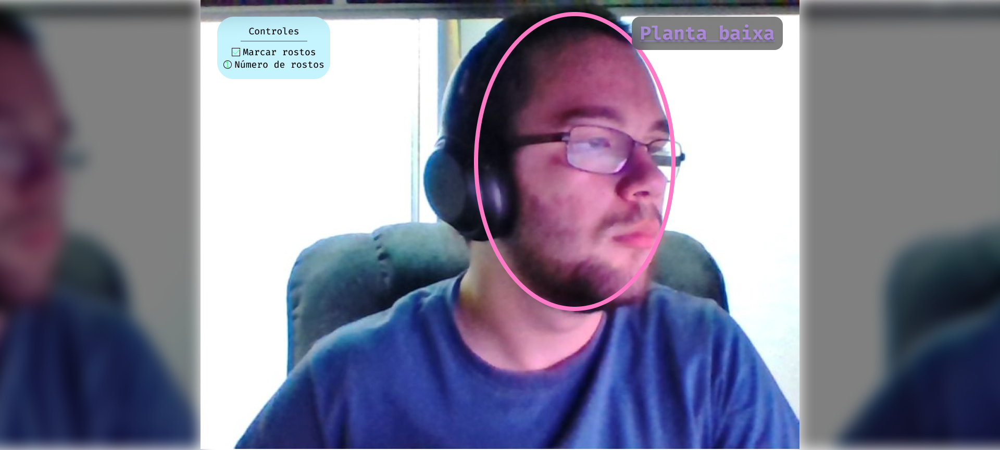
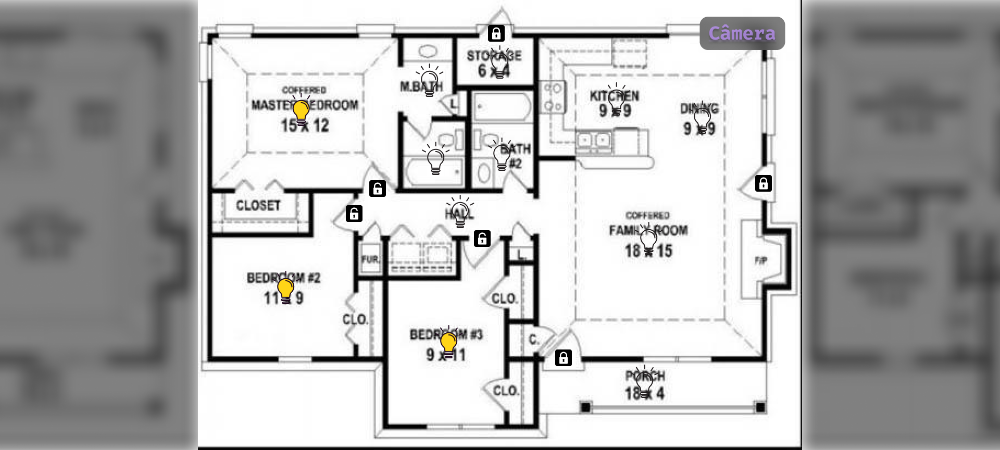

# domestic-supervisor

[][2] [][1]

Um projeto de brinquedo de simulação de casa automática.

**Table of Contents**

- [domestic-supervisor](#domestic-supervisor)
  - [Projeto](#projeto)
  - [Design da interface](#design-da-interface)
  - [Implementação](#implementação)
    - [Entidades comuns](#entidades-comuns)
    - [Entidades do supervisório](#entidades-do-supervisório)
    - [Entidades do simulador](#entidades-do-simulador)
  - [Reconhecimentos](#reconhecimentos)

## Projeto

A ideia consiste na criação de dois programas, um que possa servir de
supervisório para os sistemas de uma casa automática e outro que simule os
sistemas da casa, visto que não há bancada de teste disponível.

Eles devem se comunicar pelo protocolo MQTT, amplamente usado para a área de
domótica.

Os sistemas a serem controlados/simulados são:

- Camera com detecção de rostos;
- Travas remotas;
- Luzes remotas;

Funções do supervisório:

- Mostrar a imagem da câmera com uma marcação mostrando onde há (se houver) a
  presença de um rosto;
- Mostrar a planta da casa com indicações das travas e lâmpadas, que podem ser
  clicadas para alternar seu estado;
- Reagir aos eventos enviados pelo simulador, como mudanças de estado de
  lâmpadas ou travas;

Funções do simulador:

- Capturar a imagem da webcam do computador, enviando adequadamente pelo MQTT;
- Reagir aos eventos enviados pelo supervisório, como mudanças de estado de
  lâmpadas ou travas, informando na sua tela e devolvendo o sinal de sucesso
  para o supervisório;
- Simular a alternância das travas ou luzes no local físico, externo ao sistema,
  mostrando a planta da casa e permitindo clicar para alterar o estado;

## Design da interface

Tela da câmera:

Tela da planta baixa:

## Implementação

A implementação do projeto foi feita em C++, de acordo com as práticas de bom
código de C++ moderno.

### Entidades comuns

- Namespace `utils`:
  - Múltiplos `event`:
    - Mantém armazenados funções para serem chamadas após ser disparado;
    - Pode ser chamado como função para disparar;
    - Projetado para ser possuído por outro objeto que possui eventos como
      conceito e exposto por referência para que callbacks possam ser
      registrados;
- Namespace `controllers`:
  - 2 `state`:
    - Gerencia o estado da residência, mantendo informações sobre quais lampadas
      e travas estão ligadas;
    - Registra callbacks para realizar ações quando o estado das lampadas e/ou
      travas mudar;
  - 1 `mqtt` que herda de `mqtt::callback` e `mqtt::iaction_listener`:
    - É responsável por processar mensagens de entrada e fornecer
      uma API para enviar mensagens à outra aplicação;
- Múltiplos `device`:
  - Representa um único dispositivo, capaz de ser ativado e desativado;
  - Empacota essa informação de estado com constantes tipo (luz ou trava) e
    nome;
- Interface `view` que herda de `Wt::WContainerWidget`:
  - Representa uma tela de visualização da aplicação;
  - Possui um nome e um caminho além dos elementos de `Wt::WContainerWidget`;
- Entidades que herdam de `view` no namespace `views`;
  - 1 `blueprint`
    - É o widget raiz da tela da planta baixa;
    - É mostrado quando o usuário navega para o caminho "/blueprint";
  

### Entidades do supervisório

- Namespace `controllers`:
  - 1 `deepnet`:
    - É responsável por aplicar o algoritmo de detecção facial nas imagens
      recebidas e demarcar a posição do rosto na imagem;
    - Processa em uma thread separada, para não bloquear a interface gráfica com o
      processamento de imagem pesado;
    - Permite empurrar imagens em uma fila, as quais serão processadas em ordem
      FIFO;
    - Realiza o processamento por meio de uma rede neural profunda construída
      através da biblioteca dlib;
    - Pode ser desabilitado/habilitado, para diminuir o uso de recursos quando a
      tela da câmera não for a selecionada ou o usuário não queira que sejam
      detectados rostos;
    - Registrar callbacks para realizar ações quando o número de detecções
      encontradas mudar;
- Entidades que herdam de `view` no namespace `views`;
  - 1 `camera`:
    - É o widget raiz da tela da câmera;
    - É mostrado quando o usuário navega para o caminho "/camera" ou "/";
- Entidades que herdam de `Wt::WWidget` no namespace `widgets`:
  - 2 `page_anchor`:
    - Desenha o botão de troca de página recebendo os argumentos
      - Posição do canto superior esquerdo;
      - Entidade que implementa `view` a ser mostrada quando se clica no botão;
  - 2 `camera_panel`:
    - Desenha o painel de controle da câmera de acordo com o estado das
      detecções e atualiza a contagem quando esta muda;
- 1 `domestic_supervisor` que herda de `Wt::WApplication`:
  - Representa a aplicação como um todo;
  - Define os comportamentos de tempo de vida da aplicação (startup, connect,
    run, shutdown...);
- 1 `domestic_server` que herda de `Wt::WServer`:
  - Configura o servidor para mandar a aplicação sob multiplas URLs;
  - Cria sessões de `domstic_supervisor` sob demanda. Portanto, na prática, há
    muitas de todas as entidades, mas em nome da simplicidade, apenas o número
    presente numa única sessão é contado nessa lista;

### Entidades do simulador

- Namespace `controllers`:
  - 1 `image_loop`:
    - Coleta e envia as imagens da webcam pelo MQTT;
    - Roda em loop numa thread separada gerenciada por si;
    - É um objeto passível de ser chamado como função;
- 1 `domestic_simulator` que herda de `Wt::WApplication`:
  - Representa a aplicação como um todo;
  - Define os comportamentos de tempo de vida da aplicação (startup, connect,
    run, shutdown...);

## Reconhecimentos

Ícones das luzes feitos por
[Good Ware](https://www.flaticon.com/authors/good-ware "Good Ware") de
[https://www.flaticon.com](https://www.flaticon.com "Flaticon").

Ícones dos cadeados feitos por
[CC BY-SA 3.0](https://creativecommons.org/licenses/by-sa/3.0 "CC BY-SA 3.0"),
via Wikimedia Commons

Nota sobre CC BY-SA: Pelo que eu entendi, como os ícones regidos pela licença CC
são apenas coletados, e não modificados de alguma forma, tenho permissão para
licenciar minhas obra sob uma licença diferente.

[1]: https://builtwithnix.org "Construído com nix"
[2]: https://github.com/LuigiPiucco/domestic-supervisor/blob/master/LICENSE "Licença do Github"
